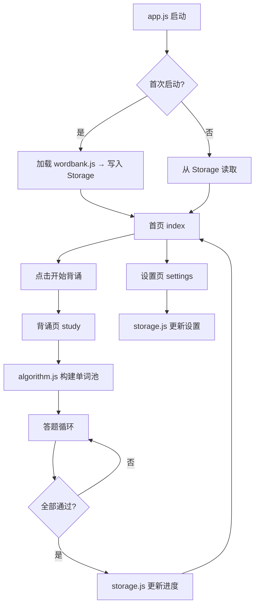

## 产品概览

一个基于微信小程序原生框架的背单词应用，使用 COCA 词频词库前 4000 词，通过四选一选择题模式帮助用户记忆单词，采用艾宾浩斯遗忘曲线算法自动安排每日复习计划。

## 核心功能

- **首页仪表盘**：展示当日学习进度（已完成数/目标数）、连续打卡天数、今日学习统计（新词/复习），以及醒目的"开始背诵"按钮
- **背诵答题页**：显示英文单词，提供 4 个中文释义选项（含 1 个正确答案 + 3 个干扰项），答对/答错有即时视觉反馈，顶部展示进度条，连续答对 3 次当日通过该单词
- **艾宾浩斯间隔复习**：按 [1, 2, 4, 7, 15, 30] 天间隔自动安排复习，6 次复习后标记为已掌握
- **每日单词池构建**：优先选取到期复习词，不足时从新词库补充，随机打乱后呈现
- **设置页**：可调节每日背诵单词数（10-100）和新词比例（10%-90%）
- **纯本地存储**：所有数据通过 wx.Storage 持久化，无需云开发

## 技术栈

- **框架**：微信小程序原生框架（JavaScript + WXML + WXSS）
- **存储**：wx.StorageSync 本地同步存储
- **词库**：coca_5000.jsonl 前 4000 行，打包为 JS 模块内置于小程序
- **运行环境**：微信小程序基础库 2.20.1+

## 实现方案

### 整体策略

基于 todo.md 中的详细设计，在现有 cloud demo 项目基础上重构：移除云开发相关代码，新增背单词业务逻辑。采用工具模块化设计（storage.js 封装存储、algorithm.js 封装算法），页面仅负责 UI 渲染和事件响应。

### 关键设计决策

1. **词库加载方案**：将 coca_5000.jsonl 前 4000 行转为 `utils/wordbank.js`，导出为数组模块，打包进小程序。首次启动时通过 `wx.setStorageSync` 写入本地 Storage，后续直接从 Storage 读取，避免冷启动时重新解析大文件。

2. **艾宾浩斯算法**：每日单词池构建时，先查 `nextReviewDate <= today` 的单词，再从新词库补充。采用伪随机选取确保干扰项不重复，每个单词连续答对 3 次当天通过。

3. **干扰项生成**：从词库中随机选取 3 个与正确答案不同的单词的中文释义作为干扰项，避免与正确答案语义相近。

4. **性能考虑**：Storage 读写为同步操作（Sync API），每次答题后实时写入。单词池在进入背诵页时一次性构建（O(n) 遍历 + 随机打乱），避免答题过程中频繁计算。

### 架构设计



### 模块划分

- **utils/storage.js**：封装所有 Storage 读写操作（词库、用户进度、每日记录、设置），提供统一接口
- **utils/algorithm.js**：艾宾浩斯间隔计算、每日单词池构建、干扰项选取、连续正确判断
- **pages/index**：首页，展示进度统计和入口
- **pages/study**：背诵页，答题交互核心
- **pages/settings**：设置页，参数调节

### 数据流

用户答题 → study 页判断正误 → 调用 algorithm.js 更新状态 → 调用 storage.js 持久化 → 全部完成 → 回到 index 页重新计算统计

## 实现细节

### 性能

- 单词池在进入 study 页时一次性构建，包含当日全部需学习的单词，避免每道题重新计算
- Storage 使用 Sync API，读写均在主线程同步完成，4KB 以内数据无性能瓶颈
- 干扰项选取使用 Fisher-Yates 洗牌后取前 3，O(n) 复杂度

### 日志

- 关键操作（初始化词库、构建单词池、答题结果）使用 `console.log` 输出，方便微信开发者工具调试
- 不涉及敏感信息

### 兼容性

- 移除原有云开发代码（app.js 中的 wx.cloud.init、index 页的云功能展示）
- 保留 sitemap.json、project.config.json 配置文件不做结构性修改
- app.json 新增 tabBar 配置，注册 study 和 settings 页面

## 目录结构

```
recite/
├── coca_5000.jsonl                  # [保留] 原始词库文件（裁剪为 4000 行）
├── miniprogram/
│   ├── app.js                       # [MODIFY] 移除云开发初始化，添加词库首次加载逻辑
│   ├── app.json                     # [MODIFY] 更新页面注册、导航栏标题、添加 tabBar
│   ├── app.wxss                     # [MODIFY] 更新全局样式（主题色、通用组件样式）
│   ├── pages/
│   │   ├── index/
│   │   │   ├── index.js             # [MODIFY] 重写：今日进度、统计数据、开始背诵入口
│   │   │   ├── index.json           # [MODIFY] 更新页面标题，移除云组件引用
│   │   │   ├── index.wxml           # [MODIFY] 重写：进度环/条、统计卡片、开始按钮
│   │   │   └── index.wxss           # [MODIFY] 重写：首页样式
│   │   ├── study/
│   │   │   ├── index.js             # [NEW] 背诵页逻辑：构建单词池、答题判断、进度更新
│   │   │   ├── index.json           # [NEW] 背诵页配置
│   │   │   ├── index.wxml           # [NEW] 背诵页布局：单词展示、4个选项、进度条
│   │   │   └── index.wxss           # [NEW] 背诵页样式
│   │   ├── settings/
│   │   │   ├── index.js             # [NEW] 设置页逻辑：读取/保存每日词数和新词比例
│   │   │   ├── index.json           # [NEW] 设置页配置
│   │   │   ├── index.wxml           # [NEW] 设置页布局：滑块/输入框
│   │   │   └── index.wxss           # [NEW] 设置页样式
│   │   └── example/                 # [DELETE] 移除云开发示例页
│   ├── utils/
│   │   ├── wordbank.js              # [NEW] 词库数据模块：coca_5000 前 4000 词数组
│   │   ├── storage.js               # [NEW] 存储工具：封装 wx.Storage 读写操作
│   │   └── algorithm.js             # [NEW] 算法工具：艾宾浩斯间隔、单词池构建、干扰项选取
│   ├── components/
│   │   └── cloudTipModal/           # [DELETE] 移除云开发提示组件
│   ├── envList.js                   # [DELETE] 移除云环境配置
│   ├── images/                      # [KEEP] 保留图片资源（后续可能复用）
│   └── sitemap.json                 # [KEEP] 保留
├── cloudfunctions/                  # [KEEP] 保留目录结构（不删除，但不再使用）
├── project.config.json              # [KEEP] 保留
└── project.private.config.json      # [KEEP] 保留
```

## 关键代码结构

### utils/storage.js 接口设计

```js
// 词库操作
function initWordBank(wordList)        // 首次初始化词库到 Storage
function getWordById(wordId)           // 根据 ID 获取单词详情
function getWordBankSize()             // 获取词库总大小

// 用户进度操作
function getProgressMap()              // 获取全部进度 Map { wordId: progressObj }
function getProgress(wordId)           // 获取单个单词进度
function updateProgress(wordId, data)  // 更新单词进度

// 每日记录操作
function getDailyRecord(date)          // 获取指定日期的学习记录
function updateDailyRecord(date, data) // 更新每日学习记录

// 设置操作
function getSettings()                 // 获取用户设置
function updateSettings(data)          // 更新用户设置

// 打卡相关
function getStreakDays()               // 计算连续打卡天数
```

### utils/algorithm.js 接口设计

```js
const EBBINGHAUS_INTERVALS = [1, 2, 4, 7, 15, 30]; // 艾宾浩斯复习间隔（天）

function getNextReviewDate(reviewStage)                    // 根据复习阶段计算下次复习日期
function buildDailyWordPool(dailyCount, newWordRatio)      // 构建每日单词池（返回单词ID数组）
function generateOptions(correctWordId, excludeIds, count) // 生成干扰选项（返回选项列表）
function isPassedToday(progress)                           // 判断单词当天是否已通过
function updateAfterAnswer(progress, isCorrect, threshold)  // 答题后更新进度（返回新进度对象）
```

### 数据模型（Storage 中的存储结构）

```js
// word_bank (Array<{id, word, meaning}>)
// user_progress: Map<wordId, {status, consecutiveCorrect, totalCorrect, totalAttempts, lastReviewDate, nextReviewDate, reviewStage, createdAt}>
// daily_record: Map<date, {wordsStudied, newWords, reviewWords, completed}>
// user_settings: {dailyWordCount: 30, newWordRatio: 0.3, correctThreshold: 3}
```

## 设计风格

采用现代简约 + 活力渐变风格，营造专注、高效的学习氛围。以柔和渐变蓝紫作为主色调，搭配圆角卡片、微妙阴影和渐进式动画，让背单词体验轻盈而愉悦。

## 页面设计

### 首页（index）

- **顶部进度区**：大圆环进度指示器（已完成/目标数），中间显示百分比数字，外围光晕动效。下方显示连续打卡天数徽章。
- **中部入口区**：醒目大按钮"开始背诵"，圆角 24rpx，渐变蓝紫背景，白色文字，悬浮阴影，点击有缩放反馈动效。
- **底部统计区**：两个并排卡片，分别展示"今日新词"和"今日复习"数量，卡片半透明背景、轻微毛玻璃效果。
- **底部导航栏**：两个 tab —「首页」和「设置」，使用图标+文字，选中态为主色调。

### 背诵页（study）

- **顶部进度条**：细长圆角进度条，显示"第 X/30 个"，渐变填充。
- **单词展示区**：居中展示英文单词，大字号（48rpx），加粗；下方展示音标（暂不显示，预留空间）。
- **选项区域**：2x2 网格布局，4 个圆角按钮。默认状态为白色底灰色边框；答对时变绿色背景+勾图标；答错时变红色背景+叉图标，同时正确答案高亮为绿色。
- **反馈动效**：答对/答错后有 0.8 秒过渡动画，之后自动进入下一题。
- **完成弹窗**：全屏遮罩 + 居中卡片，显示"今日完成"、统计摘要、确认按钮回首页。

### 设置页（settings）

- **表单区域**：白色圆角卡片，包含两个设置项——每日背诵单词数（滑块 + 数字显示，范围 10-100）、新词比例（分段选择器 10%-90%）。
- **关于信息**：底部居中显示版本号和简短说明，灰色小字。